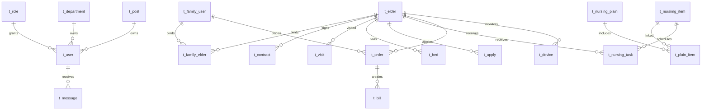

# 数据库核心设计 v1

这版是小组开工用的“精简统一版”，不是把原型所有页面都拆成独立表。目标是先统一公共字段和模块边界，避免组员各建各的表。

## 为什么不用 44 张表

44 张属于完整业务系统拆法，适合正式产品，但对本次课程项目太重：

- 组员刚开始开发，表太多容易不知道该用哪张。
- 外键太多会影响导入测试数据和删除测试数据。
- 很多详情页、审批节点、流水明细可以先用一张业务表里的状态字段承接。

因此 v1 先控制在 21 张表。后面如果某个模块确实不够用，再由组长统一扩展。

## 核心表清单

### 老师已有表，必须保留

| 表 | 说明 | 负责人 |
| --- | --- | --- |
| `t_user` | 后台用户，兼容老师登录、个人中心、修改密码 | 组长 |
| `t_menu` | 后台菜单，兼容老师动态菜单 | 组长 |
| `t_nursimg_item` | 护理项目，老师表名拼写保留 | 组员 B |
| `t_nursing_plain` | 护理计划，老师字段 `plain` 保留 | 组员 B |
| `t_plain_item` | 护理计划和护理项目关系 | 组员 B |

### 新增核心表

| 表 | 覆盖功能 | 负责人 |
| --- | --- | --- |
| `t_department` | 部门管理、用户所属部门 | 组长 |
| `t_post` | 职位管理、用户职位 | 组长 |
| `t_role` | 角色管理、菜单权限、数据权限 | 组长 |
| `t_elder` | 老人档案、在住老人、家属端家人 | 组员 A / 组员 C |
| `t_family_user` | 家属端登录账号 | 组长 |
| `t_family_elder` | 家属绑定老人 | 组员 C |
| `t_customer` | 客户管理、潜在客户跟进 | 组员 C |
| `t_visit` | 预约来访、来访登记 | 组员 A |
| `t_bed` | 房型、房间、床位、智能床位基础信息 | 组员 A |
| `t_contract` | 合同管理、家属端我的合同 | 组员 A |
| `t_apply` | 入住申请、退住申请、请假申请、协同待办 | 组员 A / 组员 C |
| `t_nursing_task` | 护理任务、负责老人、任务安排 | 组员 B |
| `t_order` | 服务订单、退款、家属端我的订单 | 组员 B |
| `t_bill` | 账单、欠费、预缴款、家属端我的账单 | 组员 B |
| `t_device` | 设备管理、报警数据、报警规则简化版 | 组员 C |
| `t_message` | 消息通知、未读已读 | 组长 |

总计：老师表 5 张 + 新增核心表 16 张 = 21 张。

## 简化合并规则

| 原型里的多个页面 | v1 合并为 |
| --- | --- |
| 预约登记、来访登记 | `t_visit`，用 `visit_stage` 区分预约/到访 |
| 房型设置、床位房型、智能床位 | `t_bed`，先把楼栋、楼层、房间、床位、设备编号放一张表 |
| 入住申请、退住申请、请假申请、我的待办、我的申请 | `t_apply`，用 `apply_type` 区分 |
| 订单管理、订单详情、退款管理 | `t_order`，先一单一服务，后续复杂再拆明细 |
| 账单管理、欠费老人、预缴款、余额查询 | `t_bill`，用 `bill_type` 区分 |
| 设备管理、报警规则、报警数据 | `t_device`，先用规则字段和报警字段承接 |
| 角色菜单权限、角色数据权限 | `t_role`，先用 `menu_ids` 和 `data_scope` 存配置 |

## 外键策略

v1 只保留老师已经用到的护理计划关系外键：

- `t_plain_item.item_id -> t_nursimg_item.id`
- `t_plain_item.plain_id -> t_nursing_plain.id`

其他业务表暂时只建索引，不加物理外键。这样组员导入数据、删除测试数据、改单表结构时更方便。字段关系由文档统一约定。

## 核心关系

## 字段命名约定

| 类型 | 约定 |
| --- | --- |
| 主键 | `id int auto_increment`，兼容老师当前 `Integer id` |
| 编号 | `xxx_no`，例如 `elder_no`、`order_no`、`contract_no` |
| 状态 | 简单启停用用 `status int`，流程状态用 `varchar(30)` |
| 金额 | `decimal(10,2)` |
| 时间 | `create_time`、`update_time`，业务时间按含义命名 |
| 图片/文件 | `avatar`、`image`、`file_url` |

## 状态约定

### 通用启停用

| 值 | 含义 |
| --- | --- |
| `1` | 启用 |
| `0` | 禁用 |

### 老人状态

| 值 | 含义 |
| --- | --- |
| `WAIT_CHECKIN` | 待入住 |
| `IN` | 在住 |
| `LEAVE` | 请假中 |
| `CHECKED_OUT` | 已退住 |

### 申请类型 `apply_type`

| 值 | 含义 |
| --- | --- |
| `CHECKIN` | 入住申请 |
| `CHECKOUT` | 退住申请 |
| `LEAVE` | 请假申请 |

### 流程状态

| 值 | 含义 |
| --- | --- |
| `DRAFT` | 草稿 |
| `PENDING` | 待处理 |
| `APPROVED` | 已通过 |
| `REJECTED` | 已驳回 |
| `DONE` | 已完成 |
| `CANCELED` | 已取消 |

### 订单状态

| 值 | 含义 |
| --- | --- |
| `CREATED` | 已创建 |
| `PAID` | 已支付 |
| `SERVING` | 服务中 |
| `FINISHED` | 已完成 |
| `CANCELED` | 已取消 |
| `REFUNDED` | 已退款 |

## 当前使用方式

这版已经同步为正式脚本 `database/zzyl.sql`。组员统一导入这个文件即可；`database/zzyl_core_v1.sql` 保留为本版设计的独立备份，后续扩展前先对照它检查差异。

## 组员开发要求

- 先按 `database/zzyl.sql` 建库。
- 不要私自新建重复表，例如不要再建 `t_room`、`t_order_detail`、`t_alert_record`。
- 如果确实需要拆表，先在群里说明，由组长统一改 SQL。
- 改 SQL 的 PR 必须写清楚影响哪些模块。
- 这版确认后，再替换正式脚本 `database/zzyl.sql`。
